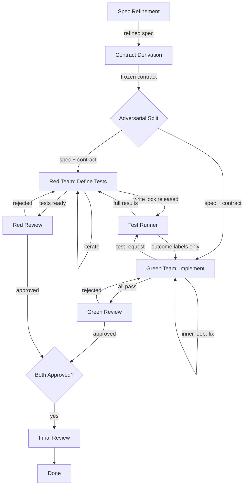

# feat: Red/Green Adversarial Development Workflow

## Overview

Implement Foundry's core workflow: an adversarial red/green team development cycle where isolated agent teams — one writing Gherkin/Cucumber tests, one writing implementation — develop a feature from a shared spec and API contract without seeing each other's work. Foundry is a single Rust binary that spawns AI CLI subprocesses in controlled working directories, enforcing information barriers at the filesystem level.

## Problem Frame

Current agentic development tools run a single agent through implement-test-review cycles with full visibility of all artifacts. This creates a feedback loop where the implementation can be shaped to game specific test assertions rather than faithfully satisfy the specification. The red/green adversarial model separates concerns: one team defines correctness criteria (tests), another implements the feature, and neither can see the other's work. The only cross-barrier signal is mechanical test outcomes (pass/fail per test name). This produces implementations that satisfy the spec's intent, not just its test suite's specific assertions.

(see origin: docs/brainstorms/2026-03-29-red-green-adversarial-workflow.md)

## Requirements Trace

- R1. Given a raw spec, Foundry refines it through an agent + reviewer iterative loop
- R2. From the refined spec, Foundry derives an API/interface contract (types, behaviors, shapes, valid errors — no example payloads) through an agent + reviewer loop
- R3. Red team writes Gherkin/Cucumber tests working from spec + contract only, with no access to implementation
- R4. Green team implements the feature working from spec + contract + test outcome labels only, with no access to test code, assertions, or error messages
- R5. Information barriers are enforced at the filesystem level via controlled working directories
- R6. The test runner is the only entity that crosses the information barrier, producing only `test_name: PASS/FAIL` labels for the green team
- R7. Green's inner loop (implement -> test -> fix) does not escalate to review until all tests pass
- R8. Red iterates when: review rejects, green passes too easily, or green fails
- R9. Green must not run tests while red is running or being reviewed (red holds write lock on test suite)
- R10. Deadlock (retry limits exceeded) pauses the workflow for human intervention
- R11. Foundry spawns AI CLI subprocesses (Claude Code, Codex, Gemini) as workers
- R12. Language/framework auto-detection for Cucumber bindings with explicit override
- R13. Workflow terminates when: all tests pass AND green reviewer approves AND red reviewer approves

## Scope Boundaries

- No arbiter agent (future improvement, tracked in `todos/arbiter-agent.md`)
- No competing parallel implementations
- No multi-model cooperation within teams
- No prompt injection hardening beyond filesystem isolation
- No multi-round escalation for deadlocks (human pause only in v1)
- No persistence/durability layer — state is in-memory for v1 (persistence is a separate foundry concern)
- No Linear/Buildkite/Tart integration — this plan covers the core engine + CLI binary
- No dashboard or observability layer

## Context & Research

### Relevant Code and Patterns

- `foundry-2/src/model.rs` — Domain types: `TaskState`, `WorkflowState`, `ReviewPolicy`, `GateResults`, `IterativeProgress`, `ImplementationState::Split`
- `foundry-2/src/engine.rs` — Pure-function state machine: `initialize_workflow`, `next_action`, `complete_*` functions. Immutable state transitions, no I/O
- `foundry-2/src/runner.rs` — `Runner` trait with `on_research`, `on_plan_iteration`, `on_execute_iteration`, `on_final_review`. `drive_to_completion` serial loop. `MockRunner` with `ScriptedResponse`
- `foundry-2/src/graph.rs` — DOT/Graphviz visualization of executed workflows
- `foundry-2/tests/e2e_workflows.rs` — E2E tests using `MockRunner` + `drive_to_completion`
- `third-thoughts/middens/` — Rust CLI patterns: `clap` for CLI, `serde`/`serde_json` for serialization, `anyhow`/`thiserror` for errors, pluggable trait pattern with registry functions

### Institutional Learnings

- **85.5% risk suppression** (`third-thoughts/docs/solutions/patterns/risk-suppression-85-percent-constant-20260320.md`): Agents suppress uncertainty 85.5% of the time. Information barriers must be filesystem-level, not prompt-level. Agents will not self-enforce barriers.
- **Session degradation** (`third-thoughts/docs/agentic-engineering-sawdust-final-synthesis.md`): Correction hazard increases 7.24x within a session. Short, disposable subprocess sessions are correct.
- **Agent-to-agent review risks hallucination multiplication** (same source): Review must use mechanical verification (test outcomes, diffs), not conversational evaluation.
- **Subprocess spawning gotchas** (`third-thoughts/docs/solutions/methodology/multi-model-refinery-synthesis-20260320.md`): Codex needs `--skip-git-repo-check`; Gemini needs `-y -s false`; each CLI has different timeout and file access semantics.
- **Cucumber in Rust** (`third-thoughts/docs/plans/2026-03-29-002-refactor-cucumber-gherkin-tests-plan.md`): `cucumber` crate v0.22, `harness = false`, `run_and_exit()` not `run()`, `fail_on_skipped()`, `futures::executor::block_on`, use `env!("CARGO_MANIFEST_DIR")` for fixture paths.

### External References

None required — local patterns and institutional learnings are sufficient.

## Key Technical Decisions

- **Engine stays pure, concurrency lives in the driver**: The state machine remains pure functions on immutable state. `next_actions` returns `Vec<ActionRequest>` for concurrent eligible actions. A new `drive_concurrent` function spawns actions in parallel (via `std::thread::scope`, not async — simpler for subprocess I/O), applies completions sequentially as they arrive. The engine never sees threads or async. Each `ActionRequest` carries a `sequence_number` that `complete_*` functions validate against current state — stale completions (from actions dispatched against an older state) are detected and discarded by the driver rather than applied. This prevents semantic violations when red's completion changes state that green's in-flight action assumed.

- **`next_actions` returns multiple actions only for Adversarial states**: For `SingleTrack` and `Split`, `next_actions` returns at most one action (preserving existing sequential semantics). Only `Adversarial` states can produce multiple concurrent actions. This avoids unintended parallelism for existing Split workflows. `next_action` is preserved as a convenience wrapper.

- **Adversarial split as a new implementation state variant**: `ImplementationState::Adversarial` extends the existing `SingleTrack`/`Split` model. This is a deliberate modeling choice: the adversarial protocol is split across the task graph (Phases 1-2 as sequential tasks) and the implementation state (Phase 3's internal coordination). A more pervasive alternative would be a new `WorkflowKind`, but the surgical approach minimizes model changes in v1. The asymmetry is documented and accepted. `RedPhase` (`Idle | Authoring | InReview`) is the write lock, modeled as workflow state — not an OS-level lock.

- **Adversarial teams are sub-state, not child TaskState nodes**: Red and green are modeled as `AdversarialTeamState` within a single `TaskState`'s `Adversarial` variant, not as separate `TaskState` children (unlike `Split`). This means the existing `update_task` / `TaskState::find` recursive traversal does not apply. Dedicated `complete_red_*` / `complete_green_*` engine functions directly modify the `Adversarial` variant's fields. The tradeoff: less code reuse with `Split` traversal, but cleaner semantics since adversarial teams have coordination state (write lock, triggers, pass history) that Split children do not.

- **`ActionRequest` carries team role**: A `TeamRole` enum (`Red | Green`) and `role: Option<TeamRole>` field on `ActionRequest` allow the `CliRunner` to dispatch to the correct workspace and prompt without reverse-engineering team membership from task IDs or state introspection. `role` is `None` for non-adversarial actions.

- **`Runner` trait uses `&self`, not `&mut self`**: Concurrent dispatch requires shared access to the runner from multiple threads. Changing the trait to `&self` is a breaking change but the only clean option — interior mutability (`Mutex`) in implementations that need mutation (e.g., `MockRunner`'s scripted response queue) is preferable to a dispatcher architecture. This affects all `Runner` implementations, present and future.

- **In-flight actions: complete-and-discard**: When the concurrent driver re-evaluates after a completion and finds a previously-dispatched action is no longer eligible (e.g., green's test run is blocked because red acquired the write lock), the in-flight action is allowed to complete and its result is discarded. No cooperative cancellation of subprocesses. This is wasteful but safe and avoids the complexity of subprocess cancellation.

- **Green starts immediately, first test run blocks on red**: Green begins implementation as soon as Phase 2 (contract derivation) completes. Green's first test run request blocks until red's first suite is reviewed and approved. This maximizes parallelism while ensuring green never runs against a nonexistent or unapproved test suite.

- **Green approval resets when red iterates**: When red iterates (any trigger), green's reviewer approval is cleared and green must re-test against the new suite. Green re-enters the inner loop automatically. This prevents termination with green approved against a stale test suite.

- **Inner loop has a separate iteration limit**: `inner_loop_limit` in config (as `Option<u32>`, defaulting to a sensible value so existing tests don't break), distinct from the review-level `retry_limit`. When exceeded, the workflow pauses for human intervention with a diagnostic. This prevents unbounded compute when green cannot satisfy a test.

- **Contract is frozen after Phase 2**: No amendments during Phase 3. Contract dispute detection is deferred — in v1, the contract freeze is enforced by the workflow structure (no engine path modifies the contract after Phase 2), not by an active detection mechanism. A `ContractDispute` error variant exists for future use when reviewers can signal contract issues via a dedicated gate.

- **Red reviewer approval resets per iteration**: Consistent with the engine's existing per-iteration review tracking. When red iterates, the previous approval is history — the new suite needs fresh review.

- **Cucumber outcome mapping**: `passed` → PASS, `failed` → FAIL, `pending`/`undefined`/`skipped`/`ambiguous` → ERROR. ERROR triggers a red iteration (test suite needs fixing), not a green fix cycle. This prevents green from chasing red team bugs. Build/compilation failures in the runner workspace are infrastructure errors routed to the orchestrator log and to red (whose step definitions caused the failure) — green sees only "test run failed: infrastructure error."

- **Test runner workspace is ephemeral**: Created fresh per test run by assembling green's implementation + red's test files. Destroyed after each run. Build artifact caching is deferred to a future optimization.

- **Trigger batching with per-test pass history**: All iteration triggers from a single test run are batched into one signal. Red receives the full outcome set (which tests passed, which failed, which passed "too easily") as a single iteration input. "Passes too easily" detection uses a `pass_history: BTreeMap<String, u32>` in `CoordinationState` tracking per-test consecutive-pass counts across test runs. Detection logic lives in the engine's `complete_green_test_run` function.

- **Role-scoped context types enforce the information barrier structurally**: The workspace manager exposes `RedContext`, `GreenContext`, and `GreenReviewerContext` types that structurally cannot include the wrong artifacts. The `CliRunner` receives a context object and passes it to the prompt template — barrier violations become type errors, not runtime bugs. `GreenReviewerContext` includes implementation + test outcomes but not test code, matching the brainstorm's information barrier table.

- **CLI provider is a trait with per-tool implementations**: `CliProvider` trait abstracts subprocess spawning. Concrete implementations for Claude Code, Codex, Gemini encapsulate tool-specific flags, timeout handling, and output capture. New providers added by implementing the trait.

- **Lock recovery is the driver's responsibility**: The engine cannot detect subprocess death (it has no I/O). The concurrent driver detects subprocess death (thread panic, timeout) and calls `reset_red_phase(state, task_id) -> WorkflowState` to release a stuck write lock. This engine function validates that red was indeed in `Authoring` or `InReview` and resets to `Idle`, restarting red's current iteration.

## Open Questions

### Resolved During Planning

- **Concurrency model**: Engine returns multiple actions via `next_actions`; driver spawns threads, applies completions sequentially. Engine stays pure. Multi-return limited to `Adversarial` states only — `Split` stays sequential. (Resolved by flow analysis showing the serial `next_action` model cannot express red/green parallelism, and architecture review showing unintended Split parallelism as a risk.)
- **Runner trait signature**: Changed from `&mut self` to `&self` to support concurrent dispatch. Interior mutability (`Mutex`) in implementations that need it. This is a breaking change to the trait, accepted as necessary. (Resolved by architecture review showing `&mut self` is incompatible with `thread::scope` shared access.)
- **Team role discrimination**: `ActionRequest` gains `role: Option<TeamRole>` field. Engine populates it for adversarial actions. `CliRunner` dispatches on role without inspecting internal state. (Resolved by both reviewers identifying the missing role field as critical.)
- **Adversarial state integration**: Teams are sub-state within a single `TaskState`, not child `TaskState` nodes. Dedicated `complete_red_*` / `complete_green_*` functions bypass `update_task` traversal. (Resolved by flow analysis showing `update_task` recursion doesn't fit adversarial coordination state.)
- **Stale completion detection**: `ActionRequest` carries a `sequence_number`. Engine's `complete_*` functions validate it against current state version. Driver discards stale completions rather than applying them. (Resolved by architecture review identifying race between concurrent completions.)
- **Green startup timing**: Green starts immediately after contract derivation; first test run blocks on red's first approved suite. (Resolved by maximizing parallelism — green has spec + contract, which is sufficient to begin.)
- **Green approval after red iteration**: Green's reviewer approval resets when red iterates. Green re-enters inner loop and must re-test against the new suite. (Resolved by flow analysis identifying the stale-approval termination bug.)
- **In-flight action semantics**: Complete-and-discard, not cancel. Wasteful but safe. (Resolved by architecture review — `thread::scope` has no cooperative cancellation.)
- **Test runner crashes**: Configurable timeout, retry up to N times, treated as infrastructure failure not attributed to either team. Exhausted retries pause for human. (Resolved by treating the test runner as critical infrastructure.)
- **Non-binary Cucumber outcomes**: Mapped to PASS/FAIL/ERROR with ERROR triggering red iteration. Build/compilation failures are infrastructure errors routed to red, not green. (Resolved by recognizing `undefined`/`skipped` are test suite issues, and build errors leak test structure.)
- **Write lock recovery**: `RedPhase` is first-class workflow state. Lock recovery is the driver's responsibility — it detects subprocess death and calls `reset_red_phase` to release stuck locks. (Resolved by architecture review identifying the gap between engine purity and subprocess liveness detection.)
- **Information barrier structure**: Role-scoped context types (`RedContext`, `GreenContext`, `GreenReviewerContext`) make barrier violations type errors. `CliRunner` constructs prompts from context types, not raw workspace paths. (Resolved by architecture review identifying prompt construction as a leakage vector.)
- **"Passes too easily" detection**: Per-test pass history (`BTreeMap<String, u32>`) tracked in `CoordinationState`. Detection logic in engine's `complete_green_test_run`. (Resolved by flow analysis identifying missing state for the trigger.)

### Deferred to Implementation

- **Exact prompt engineering for each phase**: The prompts given to agents (spec refiner, contract deriver, red team, green team, reviewers) depend on runtime experimentation. The plan specifies what context each role sees via typed context objects, not how the prompt is constructed.
- **Build artifact caching for test runner**: The ephemeral workspace approach may be too slow for large projects. Caching strategy depends on runtime performance observation.
- **"Too easily" threshold value**: The naive `n` for "passes first n times" needs tuning. Starting value is a config parameter; optimal value requires runtime data.
- **Contract dispute detection**: In v1, the contract freeze is structural (no engine path modifies it). Active detection via reviewer signaling is deferred to a future iteration. The `ContractDispute` error variant exists but has no trigger path in v1.
- **Phase 1/2 task kind mismatch**: Spec refinement and contract derivation are modeled as `FullWorkflow` tasks despite being document-production loops, not implementation tasks. The semantic mismatch is accepted as a v1 shortcut — the `CliRunner` adapts prompt semantics per phase. A dedicated `DocumentWorkflow` task kind may be warranted if more document-production phases are added.

## High-Level Technical Design

> *This illustrates the intended approach and is directional guidance for review, not implementation specification. The implementing agent should treat it as context, not code to reproduce.*

### Workflow Graph Shape



### State Machine Extension

```
Existing:  ImplementationState = SingleTrack | Split
Extended:  ImplementationState = SingleTrack | Split | Adversarial

Adversarial {
    red: TeamState { progress: IterativeProgress, inner_iterations: u32 }
    green: TeamState { progress: IterativeProgress, inner_iterations: u32 }
    red_phase: RedPhase = Idle | Authoring | InReview
    test_suite_version: u32
    test_outcomes: Option<Vec<TestOutcome>>
    coordination: CoordinationState
}

TestOutcome { name: String, result: TestResult }
TestResult = Pass | Fail | Error
CoordinationState { green_blocked: bool, pending_triggers: Vec<RedTrigger> }
RedTrigger = ReviewRejected | GreenPassedTooEasily(Vec<String>) | GreenFailed(Vec<String>)
```

### Filesystem Layout

```
workdir/
  shared/
    spec.md                    # refined spec (read-only after Phase 1)
    contract.md                # API contract (read-only after Phase 2)
  red/
    features/                  # .feature files
    step_definitions/          # step definition files
    support/                   # Cucumber config/hooks
  green/
    src/                       # implementation source
    [project files]            # Cargo.toml, package.json, etc.
  runner/                      # ephemeral, created per test run
    [green's src copied in]
    [red's tests copied in]
    [execute, capture results, destroy]
```

### Concurrent Driver Loop

```
loop:
    actions = engine.next_actions(state)  // returns Vec; max 1 for SingleTrack/Split, N for Adversarial
    if actions.empty: break

    // spawn all eligible actions concurrently
    channel = mpsc::channel()
    thread::scope(|s| {
        for action in actions:
            s.spawn(|| {
                outcome = runner.execute(action)
                channel.send((action.sequence_number, outcome))
            })

        // process completions as they arrive
        for (seq_num, outcome) in channel:
            if seq_num < state.state_version:
                // stale completion — action was dispatched against older state
                discard(outcome)
                continue
            state = engine.complete(state, outcome)
            // state_version incremented; remaining in-flight completions
            // with older seq_nums will be discarded on arrival
    })
```

## Implementation Units

- [ ] **Unit 1: Adversarial Model Types**

  **Goal:** Extend the domain model with types for adversarial red/green workflows, test outcomes, coordination state, the write lock, team role discrimination, and action sequencing.

  **Requirements:** R3, R4, R5, R6, R8, R9

  **Dependencies:** None

  **Files:**
  - Modify: `foundry-2/src/model.rs`
  - Test: `foundry-2/src/engine.rs` (inline unit tests)

  **Approach:**
  - Add `ImplementationState::Adversarial` variant alongside existing `SingleTrack` and `Split`
  - Add `ImplementationPlan::Adversarial` variant alongside existing `SingleTrack` and `Split` (the workflow builder produces a plan; the engine builds the state from it)
  - Add `AdversarialTeamState` with `IterativeProgress` + `inner_iterations: u32` counter
  - Add `RedPhase` enum (`Idle`, `Authoring`, `InReview`) as the write lock
  - Add `TestOutcome` struct (`name: String`, `result: TestResult`) and `TestResult` enum (`Pass`, `Fail`, `Error`)
  - Add `CoordinationState` with `green_blocked: bool`, `pending_triggers: Vec<RedTrigger>`, `pass_history: BTreeMap<String, u32>` (per-test consecutive-pass count for "too easily" detection), `green_approved: bool` (tracks whether green reviewer has approved, resets when red iterates)
  - Add `RedTrigger` enum: `ReviewRejected`, `GreenPassedTooEasily(Vec<String>)`, `GreenFailed(Vec<String>)`
  - Add `TeamRole` enum (`Red`, `Green`) and `role: Option<TeamRole>` field on `ActionRequest`
  - Add `sequence_number: u64` field on `ActionRequest` for stale completion detection
  - Add `state_version: u64` on `WorkflowState`, incremented on every state transition
  - Add `inner_loop_limit: Option<u32>` to `WorkflowConfig` (defaults via `Option` so existing test literals don't break — `None` means use a sensible default, e.g., 20)
  - Add `too_easily_threshold: Option<u32>` to `WorkflowConfig` (number of consecutive passes before triggering red iteration)
  - All types must derive `Clone, Debug, PartialEq, Eq` and use `BTreeMap`/`BTreeSet` for deterministic ordering, consistent with existing model types

  **Patterns to follow:**
  - `ImplementationState` and `ImplementationPlan` enum patterns in `model.rs`
  - `IterativeProgress` and `IterationRecord` tracking pattern
  - Builder pattern on `TaskBlueprint` for configuration

  **Test scenarios:**
  - Happy path: construct `Adversarial` state with both teams, verify all fields accessible
  - Happy path: `RedPhase` transitions `Idle -> Authoring -> InReview -> Idle`
  - Happy path: `TestOutcome` with Pass, Fail, Error results
  - Happy path: `TeamRole` on `ActionRequest` — Red and Green roles set correctly
  - Happy path: `pass_history` tracks per-test consecutive passes
  - Edge case: `CoordinationState` with empty triggers vs multiple simultaneous triggers
  - Edge case: `inner_loop_limit` of `None`, `Some(0)`, `Some(1)`
  - Edge case: `sequence_number` on ActionRequest is monotonically increasing

  **Verification:**
  - All new types compile and can be constructed in tests
  - Existing tests continue to pass (no breakage of `SingleTrack`/`Split` paths — `Option` fields default to `None`)

- [ ] **Unit 2: Adversarial Engine Logic**

  **Goal:** Extend the engine to handle adversarial workflow state transitions: red/green phase management, write lock enforcement, inner loop cycling, iteration trigger processing, "passes too easily" detection, and green approval reset on red iteration. Also extend `normalize` and `next_action` for the `Adversarial` variant.

  **Requirements:** R7, R8, R9, R10, R13

  **Dependencies:** Unit 1

  **Files:**
  - Modify: `foundry-2/src/engine.rs`
  - Modify: `foundry-2/src/graph.rs` (extend `render_executed_graph` for `Adversarial` — add red/green parallel lanes with coordination edges)
  - Test: `foundry-2/src/engine.rs` (inline unit tests)

  **Approach:**
  - Extend `next_action` logic to handle `Adversarial` state: return red's next action (with `role: Some(Red)`) if red is not done, return green's next action (with `role: Some(Green)`) if green is not blocked. Populate `sequence_number` from `state_version` so the driver can detect stale completions.
  - **Note:** `next_action` for `Adversarial` must be designed knowing Unit 3 will change it to return multiple actions. In Unit 2, it returns one action (the first eligible); Unit 3 changes the traversal to collect all eligible. The contract is: the adversarial branch produces a list of eligible actions, and Unit 2's `next_action` takes the first.
  - Add `complete_red_iteration` function: advance red's progress, update `RedPhase` to `Idle`, increment `test_suite_version`, process triggers. These functions bypass `update_task` — they directly match on `ImplementationState::Adversarial` and modify its fields, producing a new state.
  - Add `complete_green_test_run` function: check write lock, record test outcomes, update `pass_history` (increment consecutive-pass count for passing tests, reset for failing), evaluate "too easily" trigger (if any test's `pass_history` count >= `too_easily_threshold`, emit `GreenPassedTooEasily` trigger), decide inner loop vs review escalation, increment `inner_iterations`
  - Add `complete_green_review` function: if approved, set `green_approved = true`. Check termination: if `green_approved` + red approved (latest red iteration has passing review) + all tests pass → advance to FinalReview/Done
  - Add `complete_red_review` function: if approved, set `RedPhase::Idle`; if rejected, trigger red iteration
  - Add `reset_red_phase` function: for lock recovery by the driver when red subprocess dies. Validates red was in `Authoring` or `InReview`, resets to `Idle`, restarts red's current iteration.
  - When red iterates (any trigger): clear `green_approved`, reset green's `inner_iterations` to 0. Green must re-test against the new suite on its next test run.
  - Enforce write lock: `complete_green_test_run` returns `WorkflowError::WriteLockedTestRun` if `RedPhase != Idle`
  - Inner loop: count `inner_iterations` separately from review iterations; error with `InnerLoopExhausted` when `inner_iterations` >= `inner_loop_limit`
  - Extend `normalize` to handle `Adversarial` — when both teams are done and reviews pass, promote parent to FinalReview/Done
  - Add `ContractDispute`, `InnerLoopExhausted`, `WriteLockedTestRun`, `StaleCompletion` to `WorkflowError`

  **Patterns to follow:**
  - `complete_plan_iteration` / `complete_execute_iteration` pattern for state transitions
  - `RetryLimitReached` error pattern for inner loop exhaustion
  - `validate_split` pattern for adversarial state validation during initialization
  - `normalize` extension pattern for `Split` → apply same to `Adversarial`

  **Test scenarios:**
  - Happy path: full red cycle (author -> review approve -> idle) advances test suite version
  - Happy path: full green inner loop (implement -> test fail -> fix -> test pass) without review
  - Happy path: green passes all tests -> review approved -> workflow advances
  - Happy path: red review rejected -> red iterates -> red approval resets
  - Happy path: green passes all tests -> green reviewer rejects on code quality -> green re-implements -> re-tests -> reviewer approves
  - Happy path: "passes too easily" — test X passes 3 consecutive times (threshold=3), `GreenPassedTooEasily` trigger emitted
  - Error path: green requests test run while `RedPhase::Authoring` -> `WriteLockedTestRun`
  - Error path: green requests test run while `RedPhase::InReview` -> `WriteLockedTestRun`
  - Error path: green inner loop exceeds `inner_loop_limit` -> `InnerLoopExhausted`
  - Error path: retry limit exceeded -> `RetryLimitReached` (maps to human pause)
  - Error path: stale completion (sequence_number < state_version) -> `StaleCompletion`
  - Edge case: red iterates after green reviewer already approved -> `green_approved` cleared, green re-enters inner loop, must re-test against new suite
  - Edge case: red review approved, then trigger fires (green passes too easily) -> red iterates, both approvals reset
  - Edge case: `reset_red_phase` when red is `Idle` -> no-op or error
  - Edge case: `pass_history` resets for a test when it fails after previously passing
  - Integration: adversarial state nested inside a `FullWorkflow` task's implementation phase
  - Integration: `normalize` promotes parent task when both teams complete

  **Verification:**
  - All new engine functions produce correct state transitions
  - Write lock is enforced — no test run possible during red authoring/review
  - Inner loop counter advances independently of review iteration counter
  - Green approval resets when red iterates
  - "Passes too easily" triggers at correct threshold
  - `normalize` correctly promotes Adversarial parent
  - Existing `SingleTrack` and `Split` tests continue to pass

- [ ] **Unit 3: Concurrent Action Dispatch**

  **Goal:** Change `Runner` trait to `&self`, add `next_actions` returning multiple concurrent eligible actions (for Adversarial only), and add a `drive_concurrent` function that spawns them in parallel with stale-completion discard.

  **Requirements:** R3, R4 (parallel execution)

  **Dependencies:** Unit 2

  **Files:**
  - Modify: `foundry-2/src/engine.rs`
  - Modify: `foundry-2/src/runner.rs`
  - Test: `foundry-2/tests/e2e_workflows.rs`

  **Approach:**
  - **Breaking change: `Runner` trait methods change from `&mut self` to `&self`.** `MockRunner` wraps `VecDeque<ScriptedResponse>` and `Vec<ActionRequest>` in `Mutex` for interior mutability. Update all existing `Runner` method signatures and call sites. Update `drive_to_completion` signature accordingly.
  - Add `next_actions(config, state) -> Result<Vec<ActionRequest>>` that returns all currently eligible actions. **For `SingleTrack` and `Split`, returns at most one action** (preserving existing sequential semantics). Only `Adversarial` states can produce multiple concurrent actions (respecting write lock — green test action not eligible if red is authoring/in-review). Each `ActionRequest` has `sequence_number` set from `state_version`.
  - Preserve existing `next_action` as a convenience wrapper (`next_actions()?.into_iter().next()`)
  - Add `drive_concurrent<R: Runner + Send + Sync>(config, state, runner: &R) -> Result<WorkflowState>` in `runner.rs`:
    - Uses `std::thread::scope` to spawn parallel actions
    - Completions collected via `std::sync::mpsc` channel
    - Applied sequentially to state as they arrive
    - After each completion, check if remaining in-flight actions are stale (`sequence_number < state_version`). If stale, the completion is discarded when it arrives (not cancelled — complete-and-discard semantics)
    - Re-evaluate `next_actions` after processing all arrivals from the current batch; spawn newly eligible actions
  - `drive_to_completion` updated to use `&self` runner but remains serial

  **Patterns to follow:**
  - `drive_to_completion` loop structure for the sequential fallback
  - `std::thread::scope` for structured concurrency (no `'static` bounds needed)
  - `std::sync::mpsc` for completion channels

  **Test scenarios:**
  - Happy path: adversarial workflow returns two actions (red + green) from `next_actions`
  - Happy path: `next_actions` returns at most one action for `SingleTrack` and `Split` (backward compat)
  - Happy path: `drive_concurrent` completes a simple adversarial workflow end-to-end
  - Happy path: existing serial workflows work unchanged through `drive_concurrent` (same final state)
  - Happy path: stale completion discarded — red completes, changes state, green's in-flight completion arrives with old sequence_number, gets discarded
  - Edge case: one action completes and blocks the other (write lock acquired) — in-flight action completes, result discarded as stale
  - Edge case: both actions complete before either is applied — sequential application preserves consistency, second may be discarded if stale
  - Integration: `drive_to_completion` still works for non-adversarial workflows with `&self` runner (backward compat)

  **Verification:**
  - `next_actions` returns correct concurrent action sets respecting write lock and variant-specific limits
  - `drive_concurrent` produces the same final state as serial execution for non-adversarial workflows
  - Stale completions are detected and discarded, never applied
  - Thread safety: no data races under concurrent execution
  - All existing tests pass after `&mut self` → `&self` migration

- [ ] **Unit 4: Workspace Manager and Role-Scoped Context Types**

  **Goal:** Implement filesystem-level information barrier enforcement through controlled working directories. Expose role-scoped context types that make barrier violations a type error rather than a runtime bug.

  **Requirements:** R5, R6

  **Dependencies:** Unit 1 (model types for roles)

  **Files:**
  - Create: `foundry-2/src/workspace.rs`
  - Modify: `foundry-2/src/lib.rs` (add module export)
  - Test: `foundry-2/src/workspace.rs` (inline unit tests)

  **Approach:**
  - `WorkspaceManager` struct owns a root directory path and manages subdirectories per the layout: `shared/`, `red/`, `green/`, `runner/`
  - `create_workspace(spec, contract)` initializes the structure with shared artifacts
  - **Role-scoped context types** — structural barrier enforcement:
    - `RedContext { spec: PathBuf, contract: PathBuf, workspace: PathBuf }` — red sees spec, contract, and its own test workspace
    - `GreenContext { spec: PathBuf, contract: PathBuf, workspace: PathBuf, test_outcomes: Vec<TestOutcome> }` — green sees spec, contract, its implementation workspace, and outcome labels only
    - `GreenReviewerContext { spec: PathBuf, contract: PathBuf, workspace: PathBuf, test_outcomes: Vec<TestOutcome> }` — green reviewer sees spec, contract, implementation, and test outcomes but NOT test code
    - `RedReviewerContext { spec: PathBuf, contract: PathBuf, test_workspace: PathBuf }` — red reviewer sees spec, contract, and test code but NOT implementation
    - These types are the only way the `CliRunner` constructs prompts — it never accesses raw workspace paths directly. A prompt for green cannot reference red's test workspace because `GreenContext` has no field for it.
  - `red_context()`, `green_context(outcomes)`, `green_reviewer_context(outcomes)`, `red_reviewer_context()` methods on `WorkspaceManager` return the appropriate scoped types
  - `assemble_runner_workspace()` copies green's src + red's tests into an ephemeral `runner/` directory, returns path. This is used only by the test runner mediator, never exposed to agents.
  - `teardown_runner_workspace()` destroys the ephemeral directory (also teardown on error paths to prevent disk leaks)
  - Use `tempfile` crate for ephemeral runner workspace

  **Patterns to follow:**
  - Standard Rust file I/O patterns (`std::fs::create_dir_all`, `fs::copy`, `fs::remove_dir_all`)
  - `tempfile::TempDir` for ephemeral directories
  - Newtype/struct pattern for type-safe context (barrier violations caught at compile time)

  **Test scenarios:**
  - Happy path: create workspace, verify directory structure matches expected layout
  - Happy path: `red_context()` returns paths only within `shared/` and `red/`
  - Happy path: `green_context()` returns paths only within `shared/` and `green/`, plus outcome labels
  - Happy path: `green_reviewer_context()` includes implementation path but not test path
  - Happy path: `red_reviewer_context()` includes test path but not implementation path
  - Happy path: assemble runner workspace contains both src and tests, teardown removes it
  - Error path: workspace creation fails if root directory is not writable
  - Error path: teardown on error path — runner workspace cleaned up even if test execution fails
  - Edge case: assemble runner workspace when green has no files yet (first run before green writes anything)
  - Edge case: teardown of already-destroyed runner workspace is idempotent
  - Integration: verify green workspace contains no files from red directory (information barrier check)
  - Integration: verify context types structurally cannot reference wrong workspace paths

  **Verification:**
  - Workspace directories are created with correct structure
  - Role-scoped context types expose only permitted artifacts per role
  - Runner workspace assembly copies the right files and teardown removes them
  - Information barrier holds: no red artifacts in green workspace, no green artifacts in red workspace
  - Barrier violations are compile-time errors (wrong context type for wrong role)

- [ ] **Unit 5: CLI Provider Trait and Implementations**

  **Goal:** Abstract AI CLI subprocess spawning behind a trait with concrete implementations for Claude Code, Codex, and Gemini.

  **Requirements:** R11

  **Dependencies:** None (can develop in parallel with engine work)

  **Files:**
  - Create: `foundry-2/src/cli_provider.rs`
  - Modify: `foundry-2/src/lib.rs` (add module export)
  - Test: `foundry-2/src/cli_provider.rs` (inline unit tests)

  **Approach:**
  - `CliProvider` trait with `execute(working_dir, prompt, timeout) -> Result<CliOutput>` method
  - `CliOutput` struct: `stdout: String`, `stderr: String`, `exit_code: i32`, `duration: Duration`
  - `ClaudeCodeProvider` — spawns `claude` CLI with `--print` flag (non-interactive mode), sets working directory
  - `CodexProvider` — spawns `codex exec` with `--skip-git-repo-check` and sandbox permissions
  - `GeminiProvider` — spawns `gemini` with `-y -s false`, handles output capture quirks
  - Each provider encapsulates tool-specific flags, environment setup, and output parsing
  - Use `std::process::Command` with `.current_dir()`, `.stdout(Stdio::piped())`, timeout via thread + kill
  - Provider selection via config (string name → provider instance), consistent with `ModelProvider` enum pattern

  **Patterns to follow:**
  - Pluggable trait + registry pattern from middens (`SessionParser` trait, `all_parsers()`)
  - `std::process::Command` for subprocess spawning
  - Per-tool CLI flags documented in `multi-model-refinery-synthesis-20260320.md`

  **Test scenarios:**
  - Happy path: `ClaudeCodeProvider` constructs correct `Command` with working dir and prompt
  - Happy path: `CodexProvider` includes `--skip-git-repo-check` and sandbox permissions
  - Happy path: `GeminiProvider` includes `-y -s false` flags
  - Error path: subprocess timeout produces a timeout error, not a hang
  - Error path: subprocess exits with non-zero code produces error with stderr captured
  - Edge case: empty stdout/stderr handling
  - Edge case: very large output (truncation or streaming)

  **Execution note:** Unit tests should validate command construction without actually spawning subprocesses. Use a `MockCliProvider` for integration tests.

  **Verification:**
  - Each provider constructs the correct command with tool-specific flags
  - Timeout enforcement works (subprocess killed after limit)
  - Provider registry returns the correct implementation for each tool name

- [ ] **Unit 6: Test Runner Mediator**

  **Goal:** Execute Cucumber tests in the assembled runner workspace, parse results, and produce outcome labels respecting the information barrier.

  **Requirements:** R6, R9, R12

  **Dependencies:** Unit 4 (workspace manager), Unit 1 (test outcome types)

  **Files:**
  - Create: `foundry-2/src/test_runner.rs`
  - Modify: `foundry-2/src/lib.rs` (add module export)
  - Test: `foundry-2/src/test_runner.rs` (inline unit tests)

  **Approach:**
  - `TestRunner` struct with `execute(runner_workspace_path, language) -> Result<TestRunResult>`
  - `TestRunResult`: `outcomes: Vec<TestOutcome>`, `raw_output: String` (full output for red team and orchestrator only — green must NEVER receive this), `duration: Duration`
  - Execute Cucumber CLI for the detected language: `cargo test --test cucumber` (Rust), `npx cucumber-js` (JS), `bundle exec cucumber` (Ruby), `behave` (Python), `godog` (Go)
  - **Build/compilation phase**: Before running tests, the runner workspace must compile. If compilation fails (e.g., red's step definitions reference types green hasn't implemented), this is an infrastructure error. The compiler output is routed to the orchestrator log and to red (whose step definitions caused the failure). Green receives only `TestRunResult` with a single `TestOutcome { name: "compilation", result: Error }` — no compiler output, no type names, no structural leaks.
  - Parse Cucumber JSON output format (`--format json`) to extract per-scenario results
  - Map Cucumber statuses: `passed` → `Pass`, `failed` → `Fail`, `pending`/`undefined`/`skipped`/`ambiguous` → `Error`
  - `filter_for_green(results) -> Vec<TestOutcome>` strips everything except `test_name: result` — no messages, no stack traces, no assertion details, no `raw_output`
  - Configurable timeout per test run
  - Retry logic: up to N attempts on infrastructure failure (process crash, OOM, compilation failure), not on test failures

  **Patterns to follow:**
  - `std::process::Command` for Cucumber CLI invocation
  - `serde_json` for parsing Cucumber JSON output

  **Test scenarios:**
  - Happy path: parse Cucumber JSON with mix of passed/failed scenarios, correct TestOutcome mapping
  - Happy path: `filter_for_green` strips all detail, returns only name + result
  - Happy path: ERROR result (undefined step) mapped correctly, distinct from FAIL
  - Error path: Cucumber process crashes (non-zero exit, no JSON output) → infrastructure error with retry
  - Error path: Cucumber process hangs → timeout kills process, returns timeout error
  - Error path: malformed Cucumber JSON → parse error
  - Error path: compilation failure in runner workspace → infrastructure error, compiler output NOT in green-filtered results, only `compilation: Error`
  - Error path: compilation failure output routed to red (for step definition debugging)
  - Edge case: empty test suite (no scenarios) produces empty outcomes
  - Edge case: scenario with multiple steps where early step fails — scenario-level result is FAIL
  - Edge case: Go project using `godog` — correct CLI command invoked

  **Verification:**
  - Cucumber JSON output is correctly parsed into TestOutcome vectors
  - Green-filtered output contains no assertion details, error messages, stack traces, or compiler output
  - Compilation failures produce a generic `compilation: Error` for green, full output for red
  - Infrastructure failures are retried; test failures are not

- [ ] **Unit 7: Language and Framework Detection**

  **Goal:** Auto-detect the project's programming language and corresponding Cucumber binding to configure the test runner.

  **Requirements:** R12

  **Dependencies:** None

  **Files:**
  - Create: `foundry-2/src/detection.rs`
  - Modify: `foundry-2/src/lib.rs` (add module export)
  - Test: `foundry-2/src/detection.rs` (inline unit tests)

  **Approach:**
  - `detect_language(project_path) -> Result<ProjectLanguage>` inspects the project root for manifest files
  - Detection priority: `Cargo.toml` → Rust, `package.json` → JavaScript/TypeScript, `Gemfile` → Ruby, `pyproject.toml`/`setup.py`/`requirements.txt` → Python, `go.mod` → Go
  - `ProjectLanguage` enum with associated Cucumber runner info (CLI command, JSON format flag, feature file convention)
  - `CucumberConfig` struct: `runner_command: Vec<String>`, `json_format_flag: String`, `features_dir: String`
  - Detection runs against the project root before workspace isolation (resolving the flow analysis concern about red's isolated workspace lacking manifest files)
  - Explicit override via config file or CLI flag

  **Patterns to follow:**
  - Simple file-existence checks (`Path::exists()`)
  - Enum with associated data pattern from model types

  **Test scenarios:**
  - Happy path: detect Rust from Cargo.toml, JS from package.json, Ruby from Gemfile, Python from pyproject.toml
  - Happy path: explicit override takes precedence over auto-detection
  - Error path: no recognized manifest file → clear error message listing supported languages
  - Edge case: multiple manifest files present (e.g., Cargo.toml + package.json in a polyglot repo) → use detection priority order
  - Edge case: manifest file exists but is empty or malformed → still detect based on presence

  **Verification:**
  - Correct language detected for each supported manifest file
  - Override always wins over auto-detection
  - Clear error for unsupported projects

- [ ] **Unit 8: CLI Runner (Concrete Runner Implementation)**

  **Goal:** Implement the `Runner` trait by composing the workspace manager, CLI provider, and test runner mediator to execute the full adversarial workflow against real AI CLI subprocesses.

  **Requirements:** R1, R2, R3, R4, R5, R6, R7, R8, R9, R11

  **Dependencies:** Unit 2 (engine logic), Unit 4 (workspace), Unit 5 (CLI provider), Unit 6 (test runner), Unit 7 (detection)

  **Files:**
  - Create: `foundry-2/src/cli_runner.rs`
  - Modify: `foundry-2/src/lib.rs` (add module export)
  - Test: `foundry-2/tests/e2e_workflows.rs` (integration tests with mock CLI provider)

  **Approach:**
  - `CliRunner` struct holds: `WorkspaceManager`, `Box<dyn CliProvider>`, `TestRunner`, `CucumberConfig`, prompt templates
  - **Prompts are constructed from role-scoped context types** (from Unit 4), not raw workspace paths. The `CliRunner` calls `workspace.red_context()`, `workspace.green_context(outcomes)`, etc. and passes the context to the prompt template. This makes information barrier violations a type error.
  - Implement `Runner` trait methods (now `&self`) by dispatching to the appropriate component:
    - `on_research` → invoke CLI provider with spec refinement prompt using shared context
    - `on_plan_iteration` → invoke CLI provider with contract derivation prompt, write contract to shared workspace
    - `on_execute_iteration` → dispatch on `action.role`: `Some(Red)` → invoke in red context, `Some(Green)` → invoke in green context then run tests, `None` → non-adversarial fallback
    - `on_final_review` → dispatch on role for correct reviewer context (`green_reviewer_context` or `red_reviewer_context`)
  - For green execute iterations: after CLI provider returns, call test runner via `workspace.assemble_runner_workspace()`, produce filtered outcomes via `filter_for_green`, return outcomes
  - For red execute iterations: invoke CLI provider in red workspace, tests are the output artifact
  - **Lock recovery**: `CliRunner` (or `drive_concurrent`) detects subprocess death (thread panic, timeout) for red team actions and calls engine's `reset_red_phase` to release stuck write locks. Interior mutability (`Mutex`) protects shared state for `&self` methods.

  **Patterns to follow:**
  - `Runner` trait implementation pattern from `MockRunner` (updated to `&self` + `Mutex`)
  - Composition over inheritance — `CliRunner` delegates to specialized components
  - Role-scoped context type pattern from Unit 4

  **Test scenarios:**
  - Happy path: full spec refinement phase using mock CLI provider
  - Happy path: contract derivation phase produces contract artifact in shared workspace
  - Happy path: red team execution writes .feature and step definition files to red workspace — prompt constructed from `RedContext` only
  - Happy path: green team execution writes implementation files to green workspace — prompt constructed from `GreenContext` only, test runner invoked
  - Happy path: test outcomes filtered correctly for green (only labels, no raw output)
  - Happy path: green reviewer receives `GreenReviewerContext` (implementation + outcomes, no test code)
  - Happy path: red reviewer receives `RedReviewerContext` (test code, no implementation)
  - Error path: CLI provider timeout propagated as workflow error
  - Error path: red subprocess dies mid-authoring → lock recovery via `reset_red_phase`
  - Integration: end-to-end adversarial workflow with mock CLI provider returning scripted responses
  - Integration: verify prompts contain ONLY artifacts from the role-scoped context type (structural barrier)

  **Verification:**
  - Each phase invokes the CLI provider with the correct role-scoped context
  - Information barrier holds: green prompts never contain test code, red prompts never contain implementation code (enforced by type system, validated in tests)
  - Test outcomes are correctly filtered before reaching green team context
  - Lock recovery works when red subprocess dies

- [ ] **Unit 9: Workflow Builder**

  **Goal:** Construct the red/green adversarial workflow graph from a spec input and configuration, producing a `TaskBlueprint` ready for `initialize_workflow`.

  **Requirements:** R1, R2, R3, R4, R13

  **Dependencies:** Unit 1 (model types), Unit 2 (engine logic)

  **Files:**
  - Create: `foundry-2/src/workflow_builder.rs`
  - Modify: `foundry-2/src/lib.rs` (add module export)
  - Test: `foundry-2/src/workflow_builder.rs` (inline unit tests)

  **Approach:**
  - `build_adversarial_workflow(spec, config) -> TaskBlueprint` constructs the three-phase graph:
    - Phase 1 (spec refinement): `FullWorkflow` task, review policy from config
    - Phase 2 (contract derivation): `FullWorkflow` task, depends on Phase 1
    - Phase 3 (adversarial split): parent task that splits into red + green with `ImplementationState::Adversarial`, depends on Phase 2
  - Config specifies: review policies per phase, CLI provider selection, retry limits, inner loop limit, "too easily" threshold
  - The builder produces the blueprint; `initialize_workflow` handles the rest

  **Patterns to follow:**
  - `TaskBlueprint::full()` / `TaskBlueprint::execute_only()` builder pattern
  - `with_dependencies()` for sequencing

  **Test scenarios:**
  - Happy path: build workflow from spec + default config, verify three-phase structure with correct dependencies
  - Happy path: custom review policies propagated to each phase
  - Happy path: adversarial split phase has correct red/green team structure
  - Edge case: minimal config (all defaults) produces valid blueprint
  - Edge case: custom retry limits and inner loop limits reflected in blueprint

  **Verification:**
  - Produced blueprint initializes successfully via `initialize_workflow`
  - Dependency chain: Phase 1 → Phase 2 → Phase 3
  - Adversarial split contains red and green team states

- [ ] **Unit 10: CLI Binary**

  **Goal:** Create the `foundry` CLI binary that loads configuration, accepts a spec, and runs the adversarial workflow.

  **Requirements:** R10, R11, R12 (user-facing surface)

  **Dependencies:** Unit 8 (CLI runner), Unit 9 (workflow builder)

  **Files:**
  - Create: `foundry-2/src/main.rs`
  - Modify: `foundry-2/Cargo.toml` (add dependencies: `clap`, `serde`, `serde_json`, `anyhow`, `thiserror`, `tempfile`)
  - Create: `foundry-2/src/config.rs`
  - Test: `foundry-2/tests/cli_integration.rs`

  **Approach:**
  - `clap` CLI with subcommands: `foundry run --spec <path> [--config <path>] [--provider <name>] [--language <lang>]`
  - `Config` struct loaded from optional TOML/JSON file with defaults: retry limit, inner loop limit, "too easily" threshold, provider name, timeout values
  - `run` subcommand: load config → detect language → build workflow → create workspace → create CLI runner → call `drive_concurrent` → report outcome
  - Human pause: when workflow pauses (deadlock, inner loop exhausted, contract dispute), print diagnostic and wait for stdin input before resuming or aborting
  - Exit codes: 0 = success, 1 = workflow failed (tests never passed), 2 = human intervention needed, 3 = infrastructure error

  **Patterns to follow:**
  - `clap` derive API pattern from middens CLI
  - `anyhow` for top-level error handling
  - `serde` for config deserialization

  **Test scenarios:**
  - Happy path: `foundry run --spec spec.md` with default config produces expected workflow
  - Happy path: config file overrides default retry limits and provider
  - Happy path: `--language rust` override skips auto-detection
  - Error path: missing spec file produces clear error
  - Error path: invalid config file produces clear error with path
  - Edge case: `--help` output documents all flags and subcommands

  **Verification:**
  - Binary compiles and runs with `--help`
  - Config loading works from file and CLI flags
  - Human pause prints diagnostic and accepts resume/abort

- [ ] **Unit 11: End-to-End Integration Tests**

  **Goal:** Validate the full adversarial workflow with mock CLI providers, covering the complete coordination protocol including concurrent execution, write lock, inner loop, and termination.

  **Requirements:** R1-R13 (full workflow validation)

  **Dependencies:** All previous units

  **Files:**
  - Modify: `foundry-2/tests/e2e_workflows.rs`
  - Test: `foundry-2/tests/e2e_workflows.rs`

  **Approach:**
  - Create `MockCliProvider` that returns scripted responses (analogous to `MockRunner` but at the CLI provider level)
  - Test full workflow scenarios using `drive_concurrent` + `CliRunner` + `MockCliProvider`
  - Validate information barrier by asserting that prompts sent to green never contain test code, and prompts sent to red never contain implementation code
  - Validate write lock by asserting test runs are blocked during red authoring/review
  - Validate inner loop by asserting green cycles without review until tests pass
  - Validate termination conditions

  **Patterns to follow:**
  - `MockRunner` + `ScriptedResponse` test pattern from existing e2e tests
  - `drive_to_completion` assertion pattern

  **Test scenarios:**
  - Happy path: full adversarial workflow — spec refine → contract derive → red writes tests → green implements → tests pass → both reviewers approve → done
  - Happy path: green inner loop — green fails tests twice, fixes, passes on third attempt, then review
  - Happy path: red iteration triggered by review rejection — red updates tests, green picks up new suite
  - Error path: inner loop exhausted — green fails N times, workflow pauses
  - Error path: retry limit exhausted — review rejects too many times, workflow pauses
  - Integration: write lock blocks green test run during red authoring, green continues implementing, runs tests after red completes
  - Integration: red iteration triggered by "passes too easily" — green passes test on first attempt, red adds harder tests
  - Integration: information barrier — assert green prompts contain only spec + contract + outcome labels

  **Verification:**
  - All workflow scenarios produce correct final states
  - Information barrier assertions pass for every test
  - Concurrent execution produces correct results (no data races, no deadlocks)

## System-Wide Impact

- **Interaction graph:** The adversarial split introduces a new coordination pattern (parallel execution with write lock) that does not exist in the current engine. The `next_actions` function and `drive_concurrent` driver affect the core execution path for all workflow types, though non-adversarial workflows should behave identically through the existing serial code path.
- **Error propagation:** New error variants (`InnerLoopExhausted`, `ContractDispute`, `WriteLockedTestRun`) must propagate to the CLI binary's human-pause handler. Test runner infrastructure errors must be distinguished from test failures to route correctly (infrastructure → retry, test failure → green iteration, test error → red iteration).
- **State lifecycle risks:** The write lock (`RedPhase`) is the most sensitive piece of shared state. If it gets stuck in `Authoring` or `InReview` after a subprocess crash, green blocks indefinitely. Recovery logic must handle this case. The ephemeral runner workspace must be cleaned up even on error paths to prevent disk space leaks.
- **API surface parity:** The `Runner` trait gains a `Send` bound. `MockRunner` needs `Mutex` wrapping. Both are backward-compatible changes but affect all trait implementors.
- **Integration coverage:** Unit tests alone cannot prove the information barrier holds. The e2e tests (Unit 11) must assert on prompt contents to verify that the barrier is enforced end-to-end, not just at the workspace level.

## Risks & Dependencies

- **Subprocess reliability:** AI CLI tools may hang, crash, or produce unexpected output. Timeout enforcement and retry logic are critical. Each CLI has different failure modes documented in institutional learnings.
- **Concurrent state management:** The engine's immutable state model is inherently safe, but the `drive_concurrent` driver must apply completions sequentially. Race conditions in the driver loop could produce inconsistent state. `std::thread::scope` + channels mitigate this.
- **Cucumber output parsing:** Different Cucumber implementations produce slightly different JSON output. The parser must handle the union of formats or be configurable per language.
- **Disk I/O performance:** Ephemeral workspace creation (copy all source files + tests per test run) may be slow for large projects. This is a known tradeoff — caching is deferred.
- **External dependency:** `cucumber` crate v0.22 is a dev-dependency for testing Foundry's own tests, but the test runner mediator invokes Cucumber as an external CLI process in the target project. These are independent — Foundry doesn't need `cucumber` as a library dependency.

## Documentation / Operational Notes

- `foundry run --help` should document the full CLI interface
- A `WORKFLOW.md` template should be provided for projects adopting Foundry, documenting expected directory structure and configuration
- The "human pause" interaction (stdin prompt for resume/abort) should have clear, actionable diagnostic messages explaining why the workflow paused and what the operator can do

## Sources & References

- **Origin document:** [docs/brainstorms/2026-03-29-red-green-adversarial-workflow.md](docs/brainstorms/2026-03-29-red-green-adversarial-workflow.md)
- **Foundry v1 plan:** [docs/plans/2026-03-12-001-feat-foundry-dark-factory-v1-plan.md](docs/plans/2026-03-12-001-feat-foundry-dark-factory-v1-plan.md)
- **Existing engine:** `foundry-2/src/engine.rs`, `foundry-2/src/model.rs`, `foundry-2/src/runner.rs`
- **CLI patterns:** `third-thoughts/docs/solutions/methodology/multi-model-refinery-synthesis-20260320.md`
- **Cucumber integration:** `third-thoughts/docs/plans/2026-03-29-002-refactor-cucumber-gherkin-tests-plan.md`
- **Risk suppression finding:** `third-thoughts/docs/solutions/patterns/risk-suppression-85-percent-constant-20260320.md`
- **Agentic engineering synthesis:** `third-thoughts/docs/agentic-engineering-sawdust-final-synthesis.md`
- **Arbiter agent TODO:** `foundry/todos/arbiter-agent.md`
